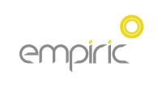
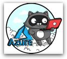
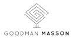

---

layout: col-sidebar
title: OWASP London
site_side: true
tags: london
level: 3
region: Europe
currency: gbp
meetup-group: OWASP-London
country: United Kingdom
postal-code: SW1V 3QW

---
<!-- rebuild -->

OWASP London
-------------
Welcome to the London chapter homepage. The chapter board is <a href="mailto:sam.stepanyan@owasp.org">Sam Stepanyan</a>, <a href="mailto:sherif.mansour@owasp.org">Sherif Mansour</a> and <a href="mailto:andra.lezza@owasp.org">Andra Lezza</a>. Follow chapter news on [Facebook](https://www.facebook.com/OWASPLondon) | [Twitter](https://twitter.com/owasplondon) | [Meetup.com](https://meetup.com/OWASP-London)

Chapter Supporters
----------------
The following are the list of OWASP Corporate Members who have generously aligned themselves with the London chapter, therefore contributing funds to our chapter:

<table cellpadding="15" cellspacing="0">
<tr>
<td>

</td>
<td>

</td>
<td>
  

</td>
</tr>
<tr>
<td>
  

</td>
<td>

</td>
<td>
  
</td>
</tr>
<tr>
<td>
  
</td>
<td>
  

</td>
<td>
  
</td>
</tr>

<tr>
<td>
  
</td>
<td>
  
</td>
<td>
  
</td>  
</tr>

<tr>
  <td>
   
  </td>
  <td>
    
  </td>
   <td>
       
    </td>

</tr>
</table>

Meeting Supporters
----------------

The following is the list of organisations who have generously provided us with space for OWASP London chapter meetings:

<table cellpadding="10" cellspacing="0" border="0">
<tr>
<td>

</td>
<td>

</td>
<td>

</td>
</tr>
<tr>
<td>

</td>
<td>

</td>
<td>

</td>
</tr>
<tr>
<td>

</td>
<td>

</td>
<td>

</td>
</tr>
<tr>
<td>

</td>
<td>

</td>
<td>
  
</td>
</tr>

<tr>
<td>

</td>
<td>

</td>
<td>

</td>
</tr>
</table>

Speaking at OWASP London Chapter Events
---------------------------------------

#### Call For Speakers

Call For Speakers is open - if you would like to present a talk on Application Security at future OWASP London Chapter events - please review and agree with the [OWASP Speaker Agreement](https://owasp.org/www-policy/legal/speaker-agreement) and send the proposed talk title, abstract and speaker bio to the Chapter Leaders via e-mail:

`owasplondon (at) owasp.org`

Next Meeting/Event(s)
---------------------


OWASP London Chapter meetings are posted on our MeetUp Page:

Please visit <a href="http://www.meetup.com/OWASP-London">http://www.meetup.com/OWASP-London</a> OWASP London MeetUp site for London Chapter event information.

Video Recordings of Past Events
--------------------------------
You can watch the recordings of talks presented at OWASP London events on our YouTube channel: https://www.youtube.com/OWASPLondon

Please [SUBSCRIBE](https://www.youtube.com/OWASPLondon?sub_confirmation=1) to our YouTube channel to get notified when new videos get published.

Updates on Social Media and Mailing List
---------------------
Please follow OWASP London Chapter on <a href="https://twitter.com/OWASPLondon">Twiter</a>/<a href="https://facebook.com/OWASPLondon">Facebook</a>/<a href="https://meetup.com/OWASP-London">MeetUp</a>/<a href="https://owasplondon.eventbrite.com">EventBrite</a>/<a href="https://www.linkedin.com/company/owasplondon">LinkedIN</a> and <a href="https://groups.google.com/a/owasp.org/forum/#!forum/london-chapter/join">sign up to our mailing list</a> to be notified about the upcoming OWASP London Chapter events.
